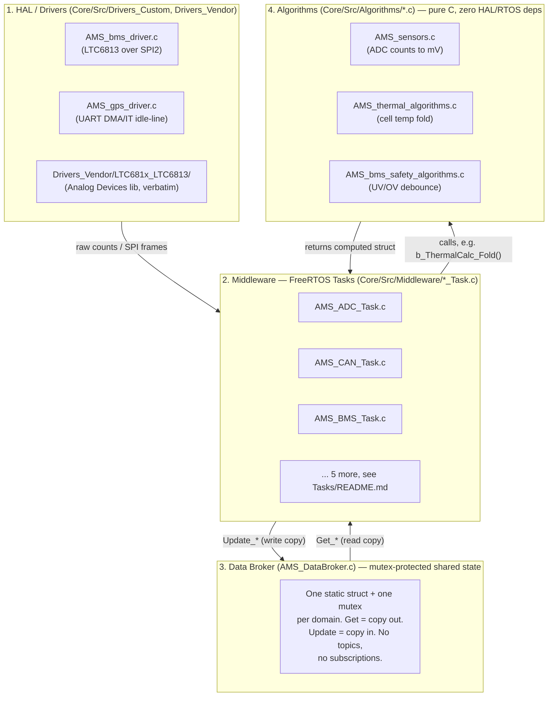
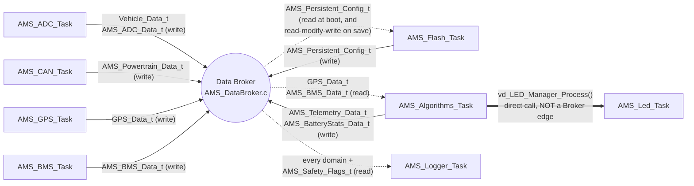

# System Architecture Overview

> **Looking for a specific task?** [`docs/Tasks/README.md`](Tasks/README.md) is the index — one row per task, with its source file, enable flag, thread name/priority/stack, init/loop function, and which Broker struct it owns. This doc explains *why* the system is shaped the way it is; that one is the quick-reference table.

This project follows a strict layered architecture pattern based on SOLID principles, utilizing FreeRTOS for task management and a Shared-State (Blackboard) model for inter-task communication.

> **Naming note:** earlier revisions of this doc called this a "Publisher/Subscriber" model. It isn't one — there is no topic subscription and no notify-on-change. It's a mutex-protected shared repository: producers write a snapshot, consumers read a copy. That's the right tool for *state* data (latest battery voltage, latest position) as opposed to *event* data (a CAN frame arriving, a GPS burst finishing) — event data already goes through real FreeRTOS Queues/Notifications, see Section 5.

## 1. Architectural Layers

The architecture is designed to decouple the hardware from the business logic, ensuring testability and modularity.

1. **Hardware Abstraction Layer (HAL) / Drivers**:
   - Contains custom drivers (`Drivers_Custom/`) that interface directly with the STM32 peripherals (ADC, CAN, UART, SDIO).
   - Isolates the RTOS tasks from register-level operations.

2. **Middleware Layer (FreeRTOS Tasks)**:
   - Contains the core application threads (`AMS_ADC_Task`, `AMS_CAN_Task`, etc.).
   - Each task runs as an independent infinite loop.
   - Tasks consume driver APIs and communicate *exclusively* via the Data Broker.
   - They do not communicate directly with each other to prevent tight coupling.

3. **Data Broker (Shared-State / Blackboard)**:
   - The central nervous system of the firmware (`AMS_DataBroker.c/h`).
   - All vehicle data (`Vehicle_Data_t`), telemetry (`AMS_Telemetry_Data_t`), and sensor readings (`AMS_ADC_Data_t`) are encapsulated here as static private variables.

4. **Domain Logic (Algorithms)**:
   - Pure C algorithms that have zero dependencies on hardware or FreeRTOS (`#include "FreeRTOS.h"` is forbidden here).
   - They process data and return results. Example: Voltage conversion, telemetry calculations.

### Layer diagram

Data only ever flows *down* into the Broker (a write) or *up* out of it (a
read). A Middleware task never calls another Middleware task directly, and
Algorithms code never calls back up into Middleware or Drivers — that's what
"layered" means here, not just a folder structure.



Concretely: `AMS_BMS_Task.c` (Middleware) calls `b_BMS_Driver_Measure()`
(Drivers_Custom) to get raw cell data, calls
`b_BmsSafety_CheckCellVoltage()` (Algorithms) to fault-check it, then calls
`b_Broker_Update_BMSData()` (Data Broker) to publish the result — three
layers touched in one task cycle, each doing exactly one job.

## 2. Inter-Task Communication (Data Broker)

To avoid race conditions and ensure thread safety across FreeRTOS tasks, **global variables are strictly prohibited**.

Instead, tasks must use the **Data Broker**:

* **Thread-Safety:** Every getter and setter in the Data Broker uses a FreeRTOS Mutex (`osMutexAcquire` / `osMutexRelease`).
* **Fast Execution:** The Mutex is held only for the duration of a memory copy (`memcpy`), ensuring no task is blocked for an extended period.
* **Usage Pattern:**
  1. A task reads a copy of a struct via a Getter (e.g., `b_Broker_Get_VehicleState(&local_veh)`).
  2. The task modifies its local copy.
  3. The task writes the entire struct back via a Setter (e.g., `b_Broker_Update_VehicleState(&local_veh)`).

### System data-flow diagram

Every task in the system, the Broker, and which struct crosses each edge —
this is the fastest way to answer "where does X get written" or "who reads
Y." Solid arrows are writes (`Update_*`, one per struct, one writer only —
see §4). Dashed arrows are reads (`Get_*`, any number of readers). The one
edge that isn't a Broker call at all (`AMS_Algorithms_Task` → `AMS_Led_Task`)
is marked as such — see `docs/Tasks/README.md` for why `AMS_Led_Task` isn't
a FreeRTOS task/Broker participant in its own right.



A few things this diagram makes visible that are easy to miss reading the
code file-by-file:

* **`AMS_Logger_Task` never writes to the Broker.** It's a pure consumer —
  reads every domain (via `b_Broker_Get_AllData()` for the SD-card row, and
  the individual `Get_*` calls for the terminal dashboard) and sends the
  result to the SD card / debug UART, never back into the Broker. That's why
  it doesn't appear in §4's ownership table as a writer of anything.
* **`AMS_Algorithms_Task` is the only task that both reads and writes
  Broker domains it doesn't own** — it reads `AMS_BMS_Data_t` (owned by
  `AMS_BMS_Task`) and `GPS_Data_t` (owned by `AMS_GPS_Task`) to compute
  derived values, then writes those results into its own two domains
  (`AMS_Telemetry_Data_t`, `AMS_BatteryStats_Data_t`). This read-other/
  write-own shape is exactly what a Broker (vs. direct task-to-task calls)
  is for.
* **`AMS_Flash_Task`'s Broker edge is bidirectional for a different reason
  than `AMS_Algorithms_Task`'s**: it's read-modify-write on its *own*
  struct (`AMS_Persistent_Config_t`) — load the last-saved value at boot,
  merge in a change (e.g. new SOC), write the merged struct back — not
  reading someone else's domain.
* **`AMS_CAN_Task` and `AMS_ADC_Task` are pure producers** today — they
  never call a Broker `Get_*` for another task's domain, only `Update_*` on
  their own.

## 3. Broker Quickstart (for new developers)

If you take nothing else from this doc: **the Broker holds the real data privately. You never touch it directly — you always get your own copy first.**

### The four-step pattern

1. A task calls a Getter, e.g. `b_Broker_Get_VehicleState(&local_copy)`.
2. Internally, the Broker locks that struct's mutex, `memcpy`s its private data into `local_copy`, then unlocks. The lock is only held for that copy — microseconds.
3. From that point on, `local_copy` is **yours**. It's an ordinary local variable. No lock, no Broker involvement, nobody else can see it. Read it, modify it, whatever you like.
4. If you want to write your changes back, call the matching Setter, e.g. `b_Broker_Update_VehicleState(&local_copy)` — same lock → copy → unlock, in the other direction.

That's the entire mechanism. Every Getter/Setter pair in `AMS_DataBroker.c` follows exactly this shape.

### Getting everything at once: `AMS_Data_t`

`AMS_Data_t` bundles every domain into one struct, so you can fetch a full snapshot in one call instead of five:

```c
AMS_Data_t prototype_1;
b_Broker_Get_AllData(&prototype_1);          // fills the whole snapshot

uint32_t batt_mV = prototype_1.vehicle.bateria_12v_mV;
int32_t  speed    = prototype_1.gps.i32_vel_kmh_x1000;
bool     gps_ok   = prototype_1.safety.b_gps_data_fresh;   // check before trusting stale data
```

Field names on `AMS_Data_t` are: `vehicle`, `bms`, `sensors`, `gps`, `telemetry`, `powertrain`, `battery_stats`, `safety` — check `AMS_DataStructs.h` for what's inside each one before guessing a field name (e.g. `Vehicle_Data_t` has no `speed` field; speed lives in `gps.i32_vel_kmh_x1000`, RPM lives in `powertrain.inverter_rpm`, and Ah/thermal/peak-current stats live in `battery_stats.{charge,thermal,current}`, not `bms`).

Two things to know:

* **You must call `b_Broker_Get_AllData()` before reading anything.** Declaring `AMS_Data_t prototype_1;` alone gives you an empty/garbage struct — it is not automatically wired to the Broker. Call it again any time you want fresher values.
* **`AMS_Data_t` needs no mutex of its own.** It's just a plain struct sitting in your own stack/memory. `b_Broker_Get_AllData()` internally calls the seven per-domain Getters one after another (vehicle, bms, adc/sensors, gps, telemetry, powertrain, battery_stats) plus `b_Broker_Get_SafetyFlags()` for the `safety` field — eight calls total, each briefly using its own already-existing mutex (or, for safety flags, no mutex at all — see the freshness section below) — no new locks are created. Because it copies domain-by-domain rather than locking everything at once, the result is not a perfectly atomic instant — vehicle data might be copied a few microseconds before gps data. Fine for dashboards/logging. If you ever need true all-or-nothing consistency across domains, that's a bigger design question — ask before assuming `Get_AllData` gives you that.

## 4. Data Ownership & Safety Tiering

Every struct in the Broker has exactly **one writer task**. Any other task may read it. This table is the single source of truth for "who is allowed to call which Setter" — if you're adding a new field or a new task, check here first, and update this table when you change ownership.

| Struct | Domain | Writer (only this task may call `Update_*`) | Typical readers | Max age before "stale" | Enforced? | Freshness-flag consumers |
|---|---|---|---|---|---|---|
| `Vehicle_Data_t` | Physical vehicle state (battery, suspension) | `AMS_ADC_Task` | Logger | 300 ms | No | Logger (CSV column only, see below) |
| `AMS_Powertrain_Data_t` | Inverter RPM (from CAN) | `AMS_CAN_Task` | Logger | 300 ms | No | Logger (CSV column only) |
| `AMS_ADC_Data_t` | Raw + converted ADC readings | `AMS_ADC_Task` | Logger | 300 ms | No | Logger (CSV column only) |
| `GPS_Data_t` | Parsed NMEA position/speed | `AMS_GPS_Task` | Algorithms Task, Logger | 2000 ms | No | Logger (CSV column only) — **not** `AMS_Algorithms_Task`, see below |
| `AMS_Telemetry_Data_t` | Derived GPS metrics (distance, max speed, accel, session + lifetime) | `AMS_Algorithms_Task` | Logger | 300 ms | No | Logger (CSV column only) |
| `AMS_BMS_Data_t` | Battery pack safety data — per-cell voltage/temp arrays, fault flags. `i32_pack_current_mA`/`soc_percent_x10` still placeholders — pack current arrives over CAN, no parser yet, and per one-writer-per-struct it must NOT be written here once one exists (see the WARNING on this struct in AMS_DataStructs.h) | `AMS_BMS_Task` (LTC6813 over SPI2) | Algorithms Task, Logger | 500 ms | No | Logger (CSV column only) — **not** `AMS_Algorithms_Task`, see below |
| `AMS_BatteryStats_Data_t` | Derived Ah in/out, thermal extremes, peak current — composes `AMS_ChargeStats_t`/`AMS_ThermalStats_t`/`AMS_CurrentStats_t`, each the output of one Algorithms module (`AMS_charge_algorithms.c`, `AMS_thermal_algorithms.c`, `AMS_current_algorithms.c`) | `AMS_Algorithms_Task` (current/charge still fold zero — no pack-current producer; thermal real as of `AMS_BMS_Task` — see that task's README) | Logger | 1500 ms | No | Logger (CSV column only) |
| `AMS_Persistent_Config_t` | Flash-backed config (SOC, cycle count) | `AMS_Flash_Task` | Logger | n/a (see Flash Task doc) | No | n/a — this struct has no entry in `AMS_Safety_Flags_t` at all, freshness was never tracked for it |

**Every struct has exactly one writer today.** `Vehicle_Data_t` and
`AMS_Powertrain_Data_t` used to be one struct (`Vehicle_Data_t` with an
`inverter_rpm` field) written by both `AMS_ADC_Task` and `AMS_CAN_Task`. That
was a **real bug**, not a safe exception: the mutex is released *between*
a task's Get and its matching Update (see the four-step pattern in Section 3),
so a CAN write landing in that window while ADC held its local copy would be
silently overwritten and lost on ADC's write-back. Splitting `inverter_rpm`
into its own struct/mutex (`AMS_Powertrain_Data_t`) removed the second writer
entirely instead of trying to synchronize it — if you're ever tempted to add
a second writer to an existing struct, split the struct instead.

### "Enforced?" — read this before assuming ownership is safe

The answer in every row above is **No — convention only.** Nothing in
`AMS_DataBroker.c` stops a second task from calling `b_Broker_Update_BMSData()`
or any other `Update_*` on a domain it doesn't own — there is no owner-task
ID stored anywhere, no `xTaskGetCurrentTaskHandle()` check, nothing. The
one-writer-per-struct rule is enforced entirely by developer discipline and
this table. That was fine while `Vehicle_Data_t`/`AMS_Powertrain_Data_t`'s
split (see above) was the only violation ever found, but it's worth being
honest about: if a future PR adds a second `Update_*` call on an existing
domain, nothing in the build will catch it, and the failure mode is the
same silent lost-update race that bug caused, not a compile error or an
assert. If this ever needs to be more than convention (e.g. once more
contributors are touching the codebase at once), the cheapest real
enforcement would be a debug-build check comparing
`osThreadGetId()` against a per-domain "expected writer" table set once at
boot — not implemented today, flagged here so nobody assumes it already is.

### "Freshness-flag consumers" — a real gap, not a documentation nitpick

Every row above shows the same answer, and it's worth stating plainly: as of
this writing, **the only consumer of any `_fresh` flag is
`AMS_Logger_Task`'s SD-card CSV writer**, and even there it doesn't *act* on
the flag — it just writes it out as a `*_FRESH` column (see
`docs/Tasks/AMS_Logger_Task/README.md`) so a person reviewing the log
offline can tell a repeated value from a genuinely new sample. Nothing in
the firmware branches on freshness at runtime:

* The terminal dashboard printer (`vd_Logger_PrintBrokerData()`) checks only
  whether each `Get_*` call *succeeded* (mutex didn't time out) — not
  whether the data it got back is stale. A domain that hasn't been updated
  in ten minutes prints exactly the same as one updated ten milliseconds
  ago.
* `AMS_Algorithms_Task` — the task with the most to lose from stale
  input, since it folds `AMS_BMS_Data_t.i32_pack_current_mA`/
  `.i16_cell_temp_cC[]` and `GPS_Data_t` into derived safety-adjacent
  numbers every 10ms — never calls `b_Broker_Get_SafetyFlags()` and never
  checks `AMS_Safety_Flags_t` before computing. It folds whatever the
  Broker's latest copy is, stale or not.
* No task anywhere calls `b_Broker_Get_SafetyFlags()` directly outside of
  `b_Broker_Get_AllData()`'s internal call (which only Logger uses).

In short: the Broker faithfully *tracks* per-domain freshness, but today
that tracking is a diagnostic breadcrumb for offline log review, not a
safety mechanism anything in the firmware currently consults before acting
on data. If a consumer ever needs "refuse to act on stale data" behavior
(the BMS fault path being the obvious future candidate), that check has to
be added explicitly at the call site — it does not come for free just
because the flag exists.

### Safety flags (freshness) — mechanism

`b_Broker_Get_SafetyFlags()` returns an `AMS_Safety_Flags_t` — one `fresh`/`stale` bool per domain above, computed by comparing each domain's last-write timestamp against its "max age" column. **This is flag-only**: the Broker does not shut anything down, override a task, or take any action when a domain goes stale — it only reports it. Each consuming task decides what a stale flag means for it (log a warning, hold last known value, refuse to act, etc) — see the previous section for who actually does that today (nobody, yet). `AMS_BMS_Data_t` reads fresh once `AMS_BMS_Task` is enabled (`TASK_BMS_ENABLE` in `AMS_task_config.h`, default off until bench-tested).

`b_Broker_Get_AllData()` fetches every domain (vehicle, bms, sensors, gps, telemetry, powertrain, battery_stats, safety) in one call, as an `AMS_Data_t`. It does **not** introduce a single global lock — internally it just calls each individual Getter in sequence, so it is not an atomic all-or-nothing snapshot across domains.

### Mutex-ordering rule

Never acquire a second Broker mutex while already holding one (e.g. don't call `b_Broker_Get_GPSData()` from inside a block where you're still holding the lock from `b_Broker_Get_VehicleState()` — release first, then call the next Getter). No code today violates this, but nothing enforces it either — as more tasks are added, holding two locks in inconsistent order across two call sites is the classic path to a deadlock. If you ever need two structs "atomically," ask before implementing — it needs a real design decision, not just grabbing both mutexes.

## 5. General Execution Models

The tasks in this project generally follow one of two execution models:

* **Event-Driven (Interrupt -> Queue/Notify -> Task):**
  - Tasks like **ADC**, **CAN**, and **GPS** spend most of their time asleep.
  - When hardware receives data, an Interrupt Service Routine (ISR) fires.
  - The ISR safely wakes the task using `vTaskNotifyGiveFromISR` or posts data to a FreeRTOS Queue using `osMessageQueuePut`.
  - The task wakes up, processes the data, updates the Broker, and goes back to sleep.
  - This ensures maximum CPU efficiency and zero polling.

* **Periodic Polling:**
  - Tasks like **Logger** and **Algorithms** (which also drives the LED state machine — see its section 4) wake up at fixed intervals using `osDelay()`.
  - They check the latest state from the Broker and perform their operations (e.g., blinking an LED, saving a file to the SD card).
