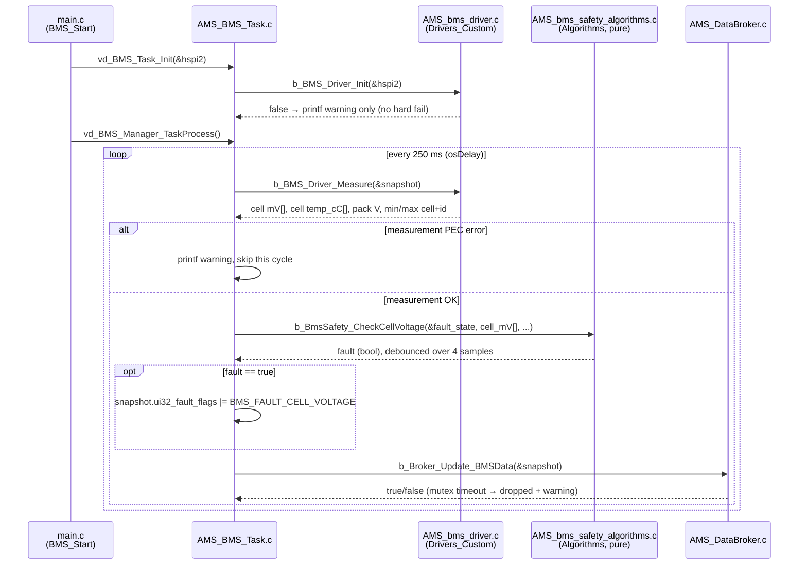

# AMS_BMS_Task

## Overview
`AMS_BMS_Task` reads the battery pack via two daisy-chained LTC6813 cell
monitor ICs over SPI2, and is the single writer of `AMS_BMS_Data_t` in the
Data Broker. Ported from `Test_4_09_2025` (a separate STM32F469I-Discovery
project built around Analog Devices' LTC681x/LTC6813 driver library, since
**deleted from this repo** — it was a bench prototype, not production code,
and its only lasting artifact is the vendor library it carried, now at
`Drivers_Vendor/LTC681x_LTC6813/`), which had this logic working on the
bench but mixed directly into one file (`spi_stm32f4.c`) together with HAL
calls, a hardcoded safety threshold check, and heavy terminal printing. This
task, its driver, and its Algorithms module are that same logic split along
this project's layering convention — same math, same register settings,
cleanly separated.

## Hardware wiring
SPI2, `PB14`=MISO, `PB15`=MOSI, `PD3`=SCK (all three AF5, configured in
`MX_SPI2_Init()` / `HAL_SPI_MspInit()`). Chip-select is `PH6`, a plain GPIO
output (SPI2 NSS=SOFT) — toggled by `Drivers_Custom/AMS_bms_driver.c`, not
by the SPI peripheral. Confirmed with the team as the real board wiring
(bench and production, same board).

**Do not reuse `Test_4_09_2025`'s PD3-as-chip-select convention.** That
project's `.ioc` labelled PD3 `"SS_BMS"`, but PD3 was actually configured
there as `SPI2_SCK` (`GPIO_MODE_AF_PP`, `GPIO_AF5_SPI2` — see its
`HAL_SPI_MspInit`). `cs_low()`/`cs_high()` toggled that pin as if it were a
plain GPIO output; in AF mode, `HAL_GPIO_WritePin` on that pin has no
electrical effect. There was no functioning, dedicated chip-select pin in
that project. PH6 here is a real, separate GPIO output — confirmed against
the actual board wiring before this task was written.

## Execution Model: Periodic Polling
`vd_BMS_Task_Init(&hspi2)` configures both LTC6813 ICs once (config
registers written, then read back to verify — same sequence as the ported
`bms_init()`). Then every `250ms` (`osDelay(250)`, same cadence as the
ported `bms_loop()`):

1. **Measure** (`Drivers_Custom/AMS_bms_driver.c`, `b_BMS_Driver_Measure()`)
   — wakes both ICs, triggers and polls the cell and aux (GPIO/NTC) ADC
   conversions, reads them back, and flattens both ICs' `cell_asic` arrays
   into `AMS_BMS_Data_t.ui16_cell_mV[BMS_TOTAL_CELLS]` and
   `.i16_cell_temp_cC[BMS_TOTAL_TEMP_CH]`, plus the derived
   `ui32_pack_voltage_mV` / min/max cell+id / `i16_max_cell_temp_cC`
   scalars. No printf, no business logic — HAL/vendor-library glue only.
2. **Safety check** (`Algorithms/AMS_bms_safety_algorithms.c`,
   `b_BmsSafety_CheckCellVoltage()`) — pure function, no HAL/RTOS deps.
   Checks every cell against `BMS_CELL_UNDERVOLTAGE_mV` (2800) /
   `BMS_CELL_OVERVOLTAGE_mV` (4300), debounced over
   `BMS_FAULT_DEBOUNCE_SAMPLES` (4) consecutive out-of-range readings
   before latching — same thresholds and debounce depth as the ported
   `safety_BMS()`. On fault, sets `BMS_FAULT_CELL_VOLTAGE` in
   `ui32_fault_flags`.
3. **Publish** — `b_Broker_Update_BMSData(&snapshot)`.

### Sequence diagram

This is the pattern every task in this codebase follows, and `AMS_BMS_Task`
is a clean example to learn it from because it touches all four layers in
one cycle and does nothing else — no queues, no ISR hand-off, just
Init → Measure → Safety check → Publish, straight through. If you're adding
a new task, this is the shape to copy.

Notice what does **not** appear here: no call from `AMS_BMS_Task` into any
other Middleware task, and no call from `AMS_bms_safety_algorithms.c` back
up into the driver or the Broker — Algorithms code takes plain arrays in and
returns a plain result out, nothing else. That one-way flow (Driver → Task →
Algorithms → Task → Broker) is what keeps each layer independently testable;
see `docs/Testing.md` for how `b_BmsSafety_CheckCellVoltage()` gets tested
on a host PC with zero hardware involved.

## Not produced by this task
- `i32_pack_current_mA` / `soc_percent_x10` stay zero. The LTC6813 measures
  cell voltage and GPIO/NTC temperature, not pack current — pack current
  is delivered over CAN, and `AMS_CAN_Task` doesn't parse a current frame
  yet. `AMS_Algorithms_Task`'s Current/Charge sections keep folding zero
  until it does (see `docs/Tasks/AMS_Algorithms_Task/README.md`).

  **When that CAN parser is written, it must NOT write into
  `AMS_BMS_Data_t`** — this task is already its sole writer
  (one-writer-per-struct), and overwrites the whole snapshot every 250ms,
  so a second writer here would silently lose CAN's current updates the
  same way `Vehicle_Data_t` used to lose RPM updates before that struct
  was split. Give pack current its own domain (or fold it into
  `AMS_Powertrain_Data_t` if it's the same CAN node as inverter RPM) — see
  the WARNING on `AMS_BMS_Data_t` in `AMS_DataStructs.h` and
  `docs/Next_Steps.md`.
- No LED indication on fault. The ported original drove LED1/LED3 directly
  from inside `safety_BMS()` — but all four Discovery board LEDs are
  already claimed for other signals in this project (GREEN=Logger
  heartbeat, BLUE=CAN TX, ORANGE=ADC activity, RED=Broker mutex-timeout
  fault). Reusing any of them for a battery cell-voltage fault would make
  that LED ambiguous between two very different failure meanings. The fault
  only surfaces via `AMS_BMS_Data_t.ui32_fault_flags & BMS_FAULT_CELL_VOLTAGE`
  today — a dedicated indicator (5th LED, or an arbitration scheme on an
  existing one) is an open product decision, not a coding gap.

## Downstream: Thermal, finally real
`AMS_Algorithms_Task`'s THERMAL section (4th of its 5 sections — Current,
Charge/SOC, Telemetry, Thermal, LED, in that order — added alongside this
task) reads `AMS_BMS_Data_t.i16_cell_temp_cC[]` and folds it through
`Algorithms/AMS_thermal_algorithms.c`'s `b_ThermalCalc_Fold()` — that
function already took a generic array+count, so no change was needed there.
This closes the thermal gap `docs/Next_Steps.md` previously flagged as
blocked on real BMS hardware.

## Files
- `Drivers_Vendor/LTC681x_LTC6813/` — Analog Devices' LTC681x/LTC6813
  library, copied verbatim (license headers intact). Not modified — treat
  as third-party.
- `Drivers_Vendor/dwt_delay/` — third-party DWT-cycle-counter microsecond
  delay utility the vendor library needs for SPI timing. Copied verbatim.
- `Drivers_Custom/AMS_bms_driver.c/h` — HAL/SPI/CS glue + orchestration of
  the vendor library calls. No business logic, no printf.
- `Algorithms/AMS_bms_safety_algorithms.c/h` — pure: NTC voltage->temp
  lookup, per-cell UV/OV debounce check. Unit tested on host
  (`test/test_AMS_bms_safety_algorithms.c`).
- `Middleware/AMS_BMS_Task.c/h` — the task itself: measure -> safety check
  -> publish.

## Enabling
`TASK_BMS_ENABLE` in `AMS_task_config.h`, default `0` — flip to `1` once
bench-tested against the real SPI2/PH6 wiring above.
